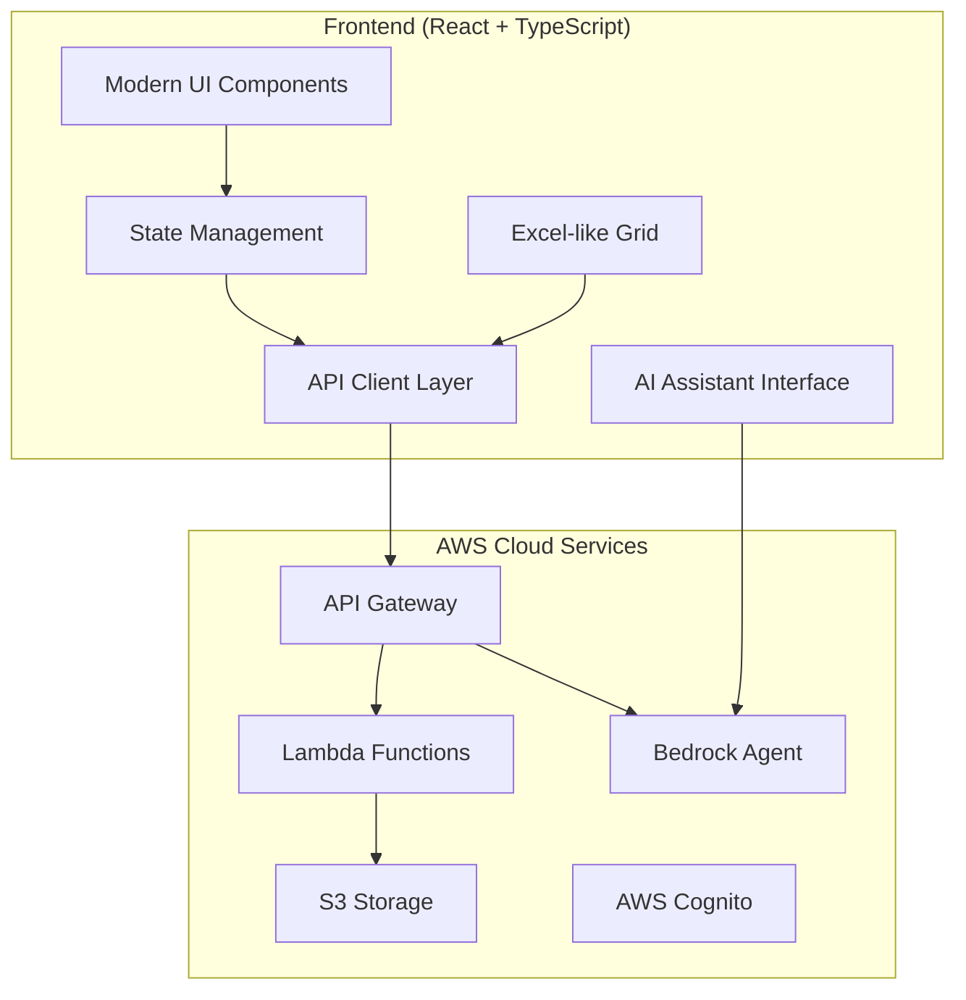
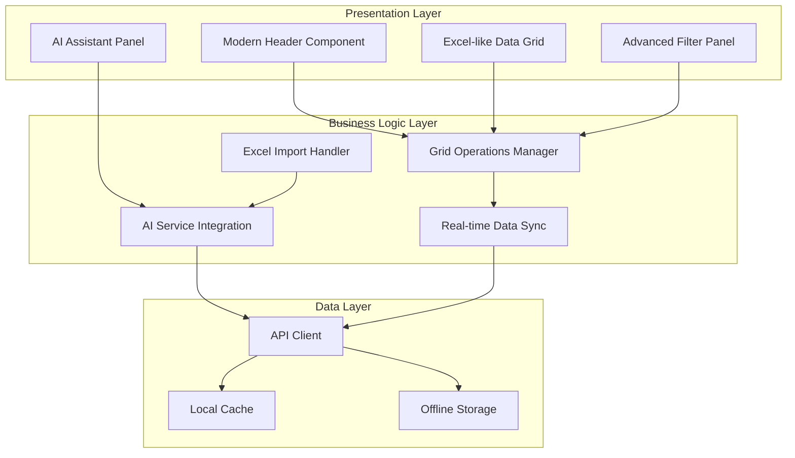

# フロントエンド改良仕様 - 設計書

## 概要

HOSHUTAROアプリケーションのフロントエンド改良設計では、現在のReact + TypeScript + Material-UIベースのアーキテクチャを維持しながら、Excelライクな操作性とモダンなデザインシステムを実現します。AWS Bedrock Agent統合とAPI Gateway連携により、クラウドネイティブな設備保全管理システムを構築します。

## アーキテクチャ

### システム全体構成



### フロントエンドアーキテクチャ



## コンポーネントとインターフェース

### 1. モダンヘッダーコンポーネント (ModernHeader)

#### 責任
- ミニマルなナビゲーション提供
- レスポンシブメニュー管理
- ユーザー認証状態表示
- AI アシスタント起動

#### インターフェース
```typescript
interface ModernHeaderProps {
  user?: User;
  onAIAssistantToggle: () => void;
  onSettingsOpen: () => void;
  isAIAssistantOpen: boolean;
}

interface HeaderAction {
  id: string;
  icon: ReactNode;
  label: string;
  onClick: () => void;
  tooltip: string;
  priority: 'high' | 'medium' | 'low';
}
```

#### 設計仕様
- **レイアウト**: Flexboxベースの水平レイアウト
- **レスポンシブ**: 768px以下でハンバーガーメニューに切り替え
- **アニメーション**: Framer Motionによるスムーズな遷移効果
- **アクセシビリティ**: ARIA属性とキーボードナビゲーション対応

### 2. Excelライクデータグリッド (ExcelLikeGrid)

#### 責任
- セルの直接編集とキーボードナビゲーション
- 列幅・行高の動的調整
- コピー&ペースト機能
- 仮想スクロールによる高速レンダリング

#### インターフェース
```typescript
interface ExcelLikeGridProps {
  data: HierarchicalData[];
  columns: GridColumn[];
  onCellEdit: (rowId: string, columnId: string, value: any) => void;
  onColumnResize: (columnId: string, width: number) => void;
  onRowResize: (rowId: string, height: number) => void;
  virtualScrolling?: boolean;
  readOnly?: boolean;
}

interface GridColumn {
  id: string;
  header: string;
  width: number;
  minWidth: number;
  maxWidth?: number;
  resizable: boolean;
  sortable: boolean;
  type: 'text' | 'number' | 'date' | 'status' | 'cost';
  editable: boolean;
}

interface CellEditContext {
  rowId: string;
  columnId: string;
  value: any;
  previousValue: any;
  isValid: boolean;
  errorMessage?: string;
}
```

#### 設計仕様
- **仮想化**: React-Windowによる大量データ対応
- **キーボード操作**: Tab/Enter/矢印キーによるセル移動
- **リサイズ**: マウスドラッグによる列幅・行高調整
- **コピー&ペースト**: クリップボードAPI活用
- **バリデーション**: リアルタイム入力検証

### 3. AIアシスタントパネル (AIAssistantPanel)

#### 責任
- Bedrock Agent APIとの通信
- チャット形式のユーザーインターフェース
- Excelファイルアップロード処理
- 提案内容の星取表反映

#### インターフェース
```typescript
interface AIAssistantPanelProps {
  isOpen: boolean;
  onClose: () => void;
  onSuggestionApply: (suggestion: MaintenanceSuggestion) => void;
  onExcelImport: (file: File) => void;
}

interface ChatMessage {
  id: string;
  type: 'user' | 'assistant' | 'system';
  content: string;
  timestamp: Date;
  attachments?: FileAttachment[];
  suggestions?: MaintenanceSuggestion[];
}

interface MaintenanceSuggestion {
  equipmentId: string;
  timeHeader: string;
  suggestedAction: 'plan' | 'actual' | 'both';
  reason: string;
  confidence: number;
  cost?: number;
}

interface ExcelImportResult {
  success: boolean;
  processedRows: number;
  errors: ImportError[];
  suggestions: DataMappingSuggestion[];
}
```

#### 設計仕様
- **レイアウト**: サイドパネル形式（右側スライドイン）
- **チャット**: メッセージ履歴とリアルタイム応答
- **ファイル処理**: ドラッグ&ドロップ対応
- **提案表示**: カード形式で適用可能な提案を表示

### 4. 高度フィルターパネル (AdvancedFilterPanel)

#### 責任
- 複数条件の組み合わせ検索
- 保存済みフィルターの管理
- リアルタイム検索結果表示
- フィルター条件の視覚化

#### インターフェース
```typescript
interface AdvancedFilterPanelProps {
  filters: FilterCondition[];
  savedFilters: SavedFilter[];
  onFilterChange: (filters: FilterCondition[]) => void;
  onSaveFilter: (name: string, filters: FilterCondition[]) => void;
  onLoadFilter: (filterId: string) => void;
}

interface FilterCondition {
  id: string;
  field: string;
  operator: FilterOperator;
  value: any;
  logicalOperator?: 'AND' | 'OR';
}

type FilterOperator = 'equals' | 'contains' | 'startsWith' | 'endsWith' | 
                     'greaterThan' | 'lessThan' | 'between' | 'in' | 'notIn';

interface SavedFilter {
  id: string;
  name: string;
  conditions: FilterCondition[];
  createdAt: Date;
  lastUsed?: Date;
}
```

## データモデル

### 拡張されたHierarchicalData

```typescript
interface EnhancedHierarchicalData extends HierarchicalData {
  // 既存フィールドに加えて
  metadata: {
    lastModified: Date;
    modifiedBy: string;
    version: number;
    syncStatus: 'synced' | 'pending' | 'conflict' | 'error';
  };
  
  // AI関連フィールド
  aiSuggestions?: MaintenanceSuggestion[];
  
  // Excel関連フィールド
  importSource?: {
    fileName: string;
    sheetName: string;
    rowNumber: number;
    importedAt: Date;
  };
  
  // UI状態
  uiState: {
    isExpanded: boolean;
    isSelected: boolean;
    isEditing: boolean;
    columnWidths: { [columnId: string]: number };
  };
}
```

### API通信モデル

```typescript
interface APIResponse<T> {
  success: boolean;
  data?: T;
  error?: {
    code: string;
    message: string;
    details?: any;
  };
  metadata: {
    timestamp: Date;
    requestId: string;
    version: string;
  };
}

interface SyncRequest {
  equipmentId: string;
  changes: Partial<HierarchicalData>;
  clientVersion: number;
  timestamp: Date;
}

interface ConflictResolution {
  strategy: 'client' | 'server' | 'merge';
  mergeRules?: { [field: string]: 'client' | 'server' | 'latest' };
}
```

## エラーハンドリング

### エラー分類と対応

```typescript
enum ErrorType {
  NETWORK_ERROR = 'NETWORK_ERROR',
  VALIDATION_ERROR = 'VALIDATION_ERROR',
  PERMISSION_ERROR = 'PERMISSION_ERROR',
  SYNC_CONFLICT = 'SYNC_CONFLICT',
  AI_SERVICE_ERROR = 'AI_SERVICE_ERROR',
  EXCEL_IMPORT_ERROR = 'EXCEL_IMPORT_ERROR'
}

interface ErrorHandler {
  handleError(error: AppError): void;
  showUserFriendlyMessage(error: AppError): void;
  logError(error: AppError): void;
  retryOperation?(operation: () => Promise<any>): Promise<any>;
}

class AppError extends Error {
  constructor(
    public type: ErrorType,
    public message: string,
    public details?: any,
    public recoverable: boolean = true
  ) {
    super(message);
  }
}
```

### エラー表示戦略

1. **ネットワークエラー**: オフラインモード提案とリトライオプション
2. **バリデーションエラー**: インライン表示と修正提案
3. **権限エラー**: 適切な権限要求ガイダンス
4. **同期競合**: 競合解決UI表示
5. **AIサービスエラー**: 代替機能提案
6. **Excelインポートエラー**: 詳細なエラーレポートと修正ガイド

## テスト戦略

### テスト階層

1. **ユニットテスト** (Jest + React Testing Library)
   - コンポーネントの個別機能
   - ビジネスロジック関数
   - ユーティリティ関数

2. **統合テスト** (Cypress)
   - コンポーネント間の連携
   - API通信フロー
   - ユーザーワークフロー

3. **E2Eテスト** (Playwright)
   - 完全なユーザージャーニー
   - クロスブラウザ対応
   - パフォーマンステスト

### テスト対象の優先順位

**高優先度**:
- セル編集とキーボードナビゲーション
- データ同期とオフライン機能
- AIアシスタントとの連携
- Excelインポート機能

**中優先度**:
- フィルタリングと検索
- レスポンシブデザイン
- エラーハンドリング

**低優先度**:
- アニメーション効果
- ツールチップ表示
- テーマ切り替え

## パフォーマンス最適化

### レンダリング最適化

1. **仮想スクロール**: React-Windowによる大量データ対応
2. **メモ化**: React.memo, useMemo, useCallbackの適切な使用
3. **遅延読み込み**: React.lazyによるコード分割
4. **バンドル最適化**: Webpack/Viteによる最適化設定

### データ管理最適化

1. **キャッシュ戦略**: React-Queryによるサーバー状態管理
2. **オフライン対応**: Service Workerとローカルストレージ
3. **差分更新**: 変更されたデータのみの送信
4. **バッチ処理**: 複数の更新をまとめて処理

### ネットワーク最適化

1. **リクエスト最適化**: GraphQLまたはREST APIの効率的な使用
2. **圧縮**: gzip/brotli圧縮の活用
3. **CDN活用**: 静的リソースの配信最適化
4. **プリフェッチ**: 予測的なデータ読み込み

## セキュリティ考慮事項

### 認証・認可

1. **AWS Cognito統合**: JWTトークンベースの認証
2. **役割ベースアクセス制御**: 機能レベルでの権限管理
3. **セッション管理**: 適切なタイムアウトと更新

### データ保護

1. **入力検証**: XSS/SQLインジェクション対策
2. **HTTPS通信**: 全通信の暗号化
3. **機密データ**: ローカルストレージでの暗号化
4. **監査ログ**: ユーザー操作の記録

## 実装技術スタック

### フロントエンド
- **フレームワーク**: React 18 + TypeScript
- **UI ライブラリ**: Material-UI v5 + カスタムコンポーネント
- **状態管理**: React Query + Zustand
- **ルーティング**: React Router v6
- **アニメーション**: Framer Motion
- **テスト**: Jest + React Testing Library + Cypress

### 開発ツール
- **ビルドツール**: Vite
- **リンター**: ESLint + Prettier
- **型チェック**: TypeScript strict mode
- **バンドル分析**: Bundle Analyzer
- **パフォーマンス**: React DevTools Profiler

### AWS統合
- **認証**: AWS Amplify Auth (Cognito)
- **API**: AWS API Gateway + Lambda
- **AI**: AWS Bedrock Agent
- **ストレージ**: AWS S3
- **監視**: AWS CloudWatch