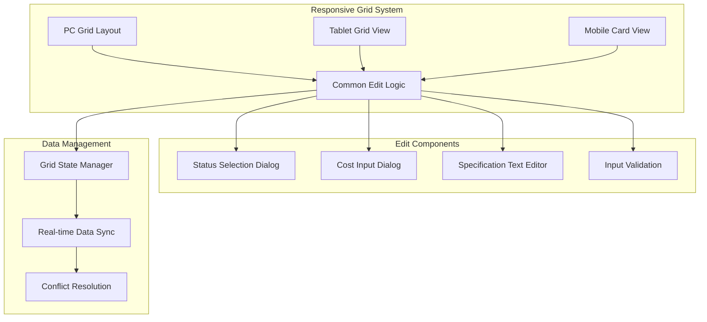
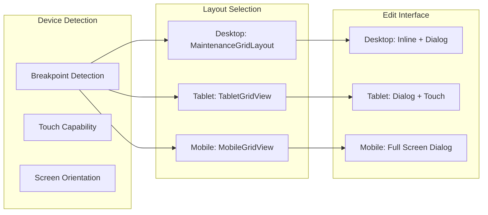

# レスポンシブグリッド編集機能改善 - 設計書

## 概要

HOSHUTAROアプリケーションのグリッド編集機能において、PC、タブレット、モバイル画面それぞれでのバグ修正とUX改善を行います。既存のReact + TypeScript + Material-UIベースのアーキテクチャを維持しながら、各デバイスに最適化された編集体験を提供します。

## アーキテクチャ

### システム全体構成



### レスポンシブレイアウト戦略



## コンポーネントとインターフェース

### 1. 共通編集ロジック (CommonEditLogic)

#### 責任
- デバイス間で一貫した編集動作の提供
- 星取表の状態管理（planned/actual）
- コスト情報の管理（planCost/actualCost）
- 機器仕様の管理（specifications配列）

#### インターフェース
```typescript
interface EditContext {
  deviceType: 'desktop' | 'tablet' | 'mobile';
  editMode: 'status' | 'cost' | 'specification';
  cellData: CellData;
  onSave: (value: any) => void;
  onCancel: () => void;
}

interface CellData {
  rowId: string;
  columnId: string;
  currentValue: any;
  dataType: 'status' | 'cost' | 'text' | 'number';
  validation?: ValidationRule[];
}

interface StatusValue {
  planned: boolean;
  actual: boolean;
  displaySymbol: '○' | '●' | '◎' | '';
  label: '未計画' | '計画' | '実績' | '両方';
}

interface CostValue {
  planCost: number;
  actualCost: number;
}

interface SpecificationValue {
  key: string;
  value: string;
  order: number;
}
```

### 2. 状態選択ダイアログ (StatusSelectionDialog)

#### 責任
- 星取表の状態選択UI提供
- デバイスに応じた表示サイズ調整
- 状態記号の視覚的表示

#### インターフェース
```typescript
interface StatusSelectionDialogProps {
  open: boolean;
  currentStatus: StatusValue;
  onSelect: (status: StatusValue) => void;
  onClose: () => void;
  deviceType: 'desktop' | 'tablet' | 'mobile';
  position?: { x: number; y: number }; // Desktop用
}

interface StatusOption {
  value: StatusValue;
  symbol: '○' | '●' | '◎' | '';
  label: '未計画' | '計画' | '実績' | '両方';
  description: string;
  color: string;
}
```

#### 設計仕様
- **デスクトップ**: ポップオーバー形式、セル位置に表示
- **タブレット**: モーダルダイアログ、タッチ操作に適したサイズ
- **モバイル**: フルスクリーンダイアログ、大きなタッチターゲット

### 3. コスト入力ダイアログ (CostInputDialog)

#### 責任
- 計画コストと実績コストの数値入力
- 入力値のバリデーション
- 通貨フォーマットの適用

#### インターフェース
```typescript
interface CostInputDialogProps {
  open: boolean;
  currentCost: CostValue;
  onSave: (cost: CostValue) => void;
  onClose: () => void;
  deviceType: 'desktop' | 'tablet' | 'mobile';
  validation?: {
    minValue?: number;
    maxValue?: number;
    required?: boolean;
  };
}

interface CostInputState {
  planCost: string; // 入力中は文字列で管理
  actualCost: string;
  planCostError?: string;
  actualCostError?: string;
  isValid: boolean;
}
```

#### 設計仕様
- **数値フォーマット**: 3桁区切りカンマ、円記号表示
- **入力検証**: 負の値チェック、最大値制限
- **キーボード**: 数値キーパッド表示（モバイル）

### 4. 機器仕様編集ダイアログ (SpecificationEditDialog)

#### 責任
- 機器仕様のキー・値ペア編集
- 動的な仕様項目の追加・削除
- 仕様項目の順序変更

#### インターフェース
```typescript
interface SpecificationEditDialogProps {
  open: boolean;
  specifications: SpecificationValue[];
  onSave: (specifications: SpecificationValue[]) => void;
  onClose: () => void;
  deviceType: 'desktop' | 'tablet' | 'mobile';
  maxItems?: number;
}

interface SpecificationEditState {
  items: SpecificationEditItem[];
  hasChanges: boolean;
  validationErrors: { [index: number]: string };
}

interface SpecificationEditItem {
  id: string;
  key: string;
  value: string;
  order: number;
  isNew?: boolean;
  isDeleted?: boolean;
}
```

### 5. レスポンシブグリッドマネージャー (ResponsiveGridManager)

#### 責任
- デバイス検出とレイアウト選択
- 編集イベントの統一処理
- パフォーマンス最適化

#### インターフェース
```typescript
interface ResponsiveGridManagerProps {
  data: HierarchicalData[];
  columns: GridColumn[];
  responsive: ResponsiveLayout;
  onCellEdit: (context: EditContext) => void;
  onSpecificationEdit: (context: EditContext) => void;
  viewMode: 'status' | 'cost';
}

interface ResponsiveGridState {
  currentLayout: 'desktop' | 'tablet' | 'mobile';
  editingCell: CellReference | null;
  editDialog: {
    type: 'status' | 'cost' | 'specification' | null;
    open: boolean;
    data: any;
  };
  touchCapabilities: TouchCapabilities;
}

interface TouchCapabilities {
  hasTouch: boolean;
  hasHover: boolean;
  hasPointerEvents: boolean;
  maxTouchPoints: number;
}
```

## データモデル

### 拡張されたセル編集モデル

```typescript
interface EnhancedCellData extends CellData {
  // 星取表専用フィールド
  statusData?: {
    planned: boolean;
    actual: boolean;
    symbol: '○' | '●' | '◎' | '';
    lastModified: Date;
    modifiedBy: string;
  };
  
  // コスト専用フィールド
  costData?: {
    planCost: number;
    actualCost: number;
    currency: string;
    lastModified: Date;
    modifiedBy: string;
  };
  
  // 機器仕様専用フィールド
  specificationData?: {
    specifications: SpecificationValue[];
    lastModified: Date;
    modifiedBy: string;
  };
  
  // 編集履歴
  editHistory: EditHistoryEntry[];
  
  // バリデーション結果
  validationResult: ValidationResult;
}

interface EditHistoryEntry {
  timestamp: Date;
  user: string;
  action: 'create' | 'update' | 'delete';
  oldValue: any;
  newValue: any;
  deviceType: 'desktop' | 'tablet' | 'mobile';
}

interface ValidationResult {
  isValid: boolean;
  errors: ValidationError[];
  warnings: ValidationWarning[];
}
```

### 状態管理モデル

```typescript
interface GridEditState {
  // 現在の編集状態
  activeEdit: {
    cellReference: CellReference;
    editType: 'status' | 'cost' | 'specification';
    originalValue: any;
    currentValue: any;
    isDirty: boolean;
  } | null;
  
  // 選択状態
  selection: {
    selectedCells: CellReference[];
    selectedRange: CellRange | null;
    focusedCell: CellReference | null;
  };
  
  // UI状態
  ui: {
    dialogStates: {
      statusSelection: boolean;
      costInput: boolean;
      specificationEdit: boolean;
    };
    loadingStates: {
      saving: boolean;
      validating: boolean;
      syncing: boolean;
    };
    errorStates: {
      validationErrors: { [cellId: string]: string[] };
      syncErrors: SyncError[];
    };
  };
  
  // パフォーマンス状態
  performance: {
    renderMetrics: RenderMetrics;
    memoryUsage: MemoryUsage;
    touchResponseTime: number;
  };
}
```

## エラーハンドリング

### エラー分類と対応戦略

```typescript
enum GridEditErrorType {
  VALIDATION_ERROR = 'VALIDATION_ERROR',
  NETWORK_ERROR = 'NETWORK_ERROR',
  DEVICE_COMPATIBILITY_ERROR = 'DEVICE_COMPATIBILITY_ERROR',
  TOUCH_INPUT_ERROR = 'TOUCH_INPUT_ERROR',
  LAYOUT_RENDERING_ERROR = 'LAYOUT_RENDERING_ERROR',
  DATA_SYNC_ERROR = 'DATA_SYNC_ERROR'
}

interface GridEditError extends Error {
  type: GridEditErrorType;
  deviceType: 'desktop' | 'tablet' | 'mobile';
  cellReference?: CellReference;
  recoveryAction?: RecoveryAction;
  userMessage: string;
  technicalDetails: any;
}

interface RecoveryAction {
  type: 'retry' | 'reset' | 'fallback' | 'manual';
  description: string;
  action: () => Promise<void>;
}
```

### デバイス別エラー表示戦略

1. **デスクトップ**: インライン表示 + ツールチップ
2. **タブレット**: モーダルダイアログ + タッチフレンドリーボタン
3. **モバイル**: フルスクリーン通知 + スワイプ操作

## テスト戦略

### テスト階層とデバイス対応

```typescript
interface ResponsiveTestSuite {
  // ユニットテスト
  unitTests: {
    editLogic: EditLogicTest[];
    validation: ValidationTest[];
    dataTransformation: DataTransformationTest[];
  };
  
  // 統合テスト
  integrationTests: {
    deviceLayouts: DeviceLayoutTest[];
    editWorkflows: EditWorkflowTest[];
    dataSync: DataSyncTest[];
  };
  
  // E2Eテスト
  e2eTests: {
    crossDevice: CrossDeviceTest[];
    touchInteraction: TouchInteractionTest[];
    performanceTest: PerformanceTest[];
  };
}

interface DeviceLayoutTest {
  deviceType: 'desktop' | 'tablet' | 'mobile';
  screenSizes: ScreenSize[];
  orientations: 'portrait' | 'landscape' | 'both';
  testCases: LayoutTestCase[];
}

interface TouchInteractionTest {
  gestures: TouchGesture[];
  expectedBehavior: ExpectedBehavior;
  fallbackBehavior: FallbackBehavior;
}
```

### テスト対象の優先順位

**高優先度**:
- 星取表の状態選択機能
- デバイス間でのデータ整合性
- タッチ操作の応答性
- レイアウト崩れの防止

**中優先度**:
- コスト入力の数値検証
- 機器仕様編集の動的追加・削除
- エラーハンドリングとリカバリ

**低優先度**:
- アニメーション効果
- 高度なキーボードショートカット
- パフォーマンス最適化

## パフォーマンス最適化

### レスポンシブ最適化戦略

```typescript
interface ResponsiveOptimization {
  // レンダリング最適化
  rendering: {
    virtualScrolling: VirtualScrollConfig;
    lazyLoading: LazyLoadConfig;
    memoization: MemoizationConfig;
  };
  
  // タッチ最適化
  touch: {
    debouncing: DebounceConfig;
    gestureRecognition: GestureConfig;
    hapticFeedback: HapticConfig;
  };
  
  // メモリ最適化
  memory: {
    caching: CacheConfig;
    garbageCollection: GCConfig;
    dataCompression: CompressionConfig;
  };
}

interface VirtualScrollConfig {
  enabled: boolean;
  itemHeight: number;
  overscan: number;
  threshold: number; // データ件数の閾値
}

interface TouchOptimization {
  minTouchTarget: number; // 最小44px
  touchDelay: number; // タッチ遅延
  scrollThreshold: number; // スクロール感度
  gestureTimeout: number; // ジェスチャータイムアウト
}
```

### デバイス別最適化

1. **デスクトップ**: 高精度マウス操作、キーボードショートカット
2. **タブレット**: タッチ操作最適化、画面回転対応
3. **モバイル**: 片手操作対応、バッテリー消費最適化

## セキュリティ考慮事項

### 入力検証とサニタイゼーション

```typescript
interface InputValidation {
  // 星取表状態検証
  statusValidation: {
    allowedValues: StatusValue[];
    stateTransitionRules: StateTransitionRule[];
  };
  
  // コスト入力検証
  costValidation: {
    minValue: number;
    maxValue: number;
    decimalPlaces: number;
    currencyFormat: string;
  };
  
  // 機器仕様検証
  specificationValidation: {
    maxKeyLength: number;
    maxValueLength: number;
    allowedCharacters: RegExp;
    maxItems: number;
  };
}

interface StateTransitionRule {
  from: StatusValue;
  to: StatusValue;
  allowed: boolean;
  requiresConfirmation?: boolean;
}
```

### データ保護

1. **入力サニタイゼーション**: XSS攻撃防止
2. **データ暗号化**: ローカルストレージでの機密データ保護
3. **アクセス制御**: 編集権限の適切な管理
4. **監査ログ**: 編集操作の記録と追跡

## アクセシビリティ対応

### WCAG 2.1 AA準拠

```typescript
interface AccessibilityFeatures {
  // キーボードナビゲーション
  keyboard: {
    tabOrder: TabOrderConfig;
    shortcuts: KeyboardShortcut[];
    focusManagement: FocusManagementConfig;
  };
  
  // スクリーンリーダー対応
  screenReader: {
    ariaLabels: AriaLabelConfig;
    liveRegions: LiveRegionConfig;
    descriptions: DescriptionConfig;
  };
  
  // 視覚的アクセシビリティ
  visual: {
    colorContrast: ColorContrastConfig;
    fontSize: FontSizeConfig;
    focusIndicators: FocusIndicatorConfig;
  };
  
  // モーター機能対応
  motor: {
    largeTargets: boolean; // 最小44px
    alternativeInputs: AlternativeInputConfig;
    gestureAlternatives: GestureAlternativeConfig;
  };
}
```

### デバイス別アクセシビリティ

1. **デスクトップ**: キーボード完全対応、スクリーンリーダー最適化
2. **タブレット**: 大きなタッチターゲット、音声フィードバック
3. **モバイル**: 片手操作対応、振動フィードバック

## 実装技術スタック

### フロントエンド技術
- **フレームワーク**: React 18 + TypeScript
- **UI ライブラリ**: Material-UI v5 + カスタムレスポンシブコンポーネント
- **状態管理**: React Query + Zustand
- **レスポンシブ**: CSS Grid + Flexbox + Media Queries
- **タッチ処理**: React Touch Events + Hammer.js
- **テスト**: Jest + React Testing Library + Cypress + Playwright

### パフォーマンス監視
- **レンダリング**: React DevTools Profiler
- **メモリ**: Chrome DevTools Memory
- **タッチ応答**: Performance API
- **ネットワーク**: Network Information API

### 開発ツール
- **デバイステスト**: Chrome DevTools Device Mode
- **レスポンシブテスト**: BrowserStack
- **アクセシビリティテスト**: axe-core + WAVE
- **パフォーマンステスト**: Lighthouse + WebPageTest