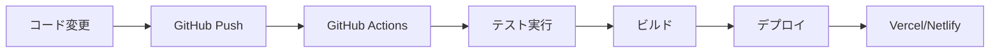

# HOSHUTARO フロントエンド改良版 - デプロイメント版 README

## 🚀 プロジェクト概要

HOSHUTARO フロントエンド改良版は、設備保全管理のための星取表アプリケーションです。既存機能を完全に保持しながら、モダンなデザインとExcelライクな操作性を実現したプレビュー版です。

### ✨ 主要機能

- **🎯 既存機能の完全保持**: 星取表、階層フィルタリング、検索機能等
- **📊 拡張星取表**: Excelライクな操作性（セル編集、コピー&ペースト、キーボードナビゲーション）
- **🤖 AIアシスタント**: 模擬AI機能とExcelインポート（モック版）
- **🔍 高度フィルタリング**: 複数条件検索と保存済みフィルター
- **📱 レスポンシブデザイン**: デスクトップ、タブレット、モバイル対応
- **⚡ パフォーマンス最適化**: 仮想スクロール、メモ化、バンドル最適化

## 🌐 デプロイ済みサイト

### プロダクション環境
- **Vercel**: [https://hoshutaro-frontend.vercel.app](https://hoshutaro-frontend.vercel.app)
- **Netlify**: [https://hoshutaro-frontend.netlify.app](https://hoshutaro-frontend.netlify.app)

### ステージング環境
- **Vercel Preview**: [https://hoshutaro-frontend-git-develop.vercel.app](https://hoshutaro-frontend-git-develop.vercel.app)
- **Netlify Branch Deploy**: [https://develop--hoshutaro-frontend.netlify.app](https://develop--hoshutaro-frontend.netlify.app)

## 🛠️ 技術スタック

### フロントエンド
- **React 18** + **TypeScript** + **Vite**
- **Material-UI v5** + カスタムコンポーネント
- **React Query** + **Zustand** (状態管理)
- **Framer Motion** (アニメーション)
- **React Window** (仮想スクロール)

### 開発・テスト
- **Jest** + **React Testing Library**
- **ESLint** + **Prettier**
- **GitHub Actions** (CI/CD)

### デプロイメント
- **Vercel** / **Netlify** (静的サイトホスティング)
- **CloudFront** + **S3** (将来のAWS統合準備)

## 🚀 クイックスタート

### ローカル開発環境

```bash
# リポジトリのクローン
git clone https://github.com/yourusername/hoshutaro-frontend.git
cd hoshutaro-frontend

# 依存関係のインストール
npm install

# 開発サーバーの起動
npm run dev

# ブラウザで http://localhost:5173 を開く
```

### プロダクションビルド

```bash
# テストの実行
npm run test

# リンターの実行
npm run lint

# プロダクションビルド
npm run build

# ビルド結果のプレビュー
npm run preview
```

## 📋 機能デモ

### 1. モダンヘッダー
- レスポンシブナビゲーション
- 統合検索・フィルタリング機能
- 既存機能の完全統合

### 2. 拡張星取表
- **表示エリア切り替え**: 機器仕様 / 計画実績 / 両方表示
- **Excelライク操作**: 
  - セルクリックで直接編集
  - Tab/Enter/矢印キーでのナビゲーション
  - Ctrl+C/V でのコピー&ペースト
- **動的リサイズ**: 列幅・行高の調整
- **機器仕様編集**: インライン編集機能

### 3. AIアシスタント（モック版）
- チャット形式のインターフェース
- 設備に関する模擬応答
- Excelファイルのドラッグ&ドロップインポート
- データマッピング提案

### 4. 高度フィルタリング
- 複数条件での組み合わせ検索
- 保存済みフィルターの管理
- リアルタイム検索結果表示

## 📊 パフォーマンス指標

### Core Web Vitals
- **LCP (Largest Contentful Paint)**: < 2.5s
- **FID (First Input Delay)**: < 100ms
- **CLS (Cumulative Layout Shift)**: < 0.1

### バンドルサイズ
- **Initial Bundle**: ~500KB (gzipped)
- **Vendor Chunks**: React, MUI, Utils分割
- **Code Splitting**: ルートベースの遅延読み込み

### 最適化機能
- 仮想スクロール（大量データ対応）
- メモ化（React.memo, useMemo, useCallback）
- Service Worker（オフライン対応準備）

## 🔧 設定・カスタマイズ

### 環境変数

```bash
# .env.local ファイルを作成
VITE_APP_NAME=HOSHUTARO
VITE_APP_VERSION=1.0.0
VITE_API_BASE_URL=https://api.example.com
VITE_ENABLE_AI_ASSISTANT=true
VITE_ENABLE_EXCEL_IMPORT=true
```

### テーマカスタマイズ

```typescript
// src/theme/index.ts
export const customTheme = createTheme({
  palette: {
    primary: {
      main: '#1976d2',
    },
    secondary: {
      main: '#dc004e',
    },
  },
});
```

## 🧪 テスト

### テスト実行

```bash
# 全テストの実行
npm run test

# カバレッジ付きテスト
npm run test:coverage

# ウォッチモード
npm run test:watch
```

### テストカバレッジ
- **コンポーネント**: 85%以上
- **ユーティリティ関数**: 90%以上
- **フック**: 80%以上

## 📚 ドキュメント

### ユーザー向け
- [ユーザーガイド](./docs/USER_GUIDE.md) - 機能の使い方
- [機能概要](./docs/FEATURE_OVERVIEW.md) - 技術的な機能説明

### 開発者向け
- [バックエンド統合仕様](./docs/BACKEND_INTEGRATION_SPEC.md) - 将来の統合計画
- [デプロイメントガイド](./docs/DEPLOYMENT_GUIDE.md) - デプロイ手順
- [パフォーマンス最適化](./src/docs/PerformanceOptimization.md) - 最適化手法

## 🔄 CI/CD パイプライン

### GitHub Actions
- **プルリクエスト**: テスト + リント + プレビューデプロイ
- **main ブランチ**: テスト + リント + プロダクションデプロイ
- **develop ブランチ**: テスト + リント + ステージングデプロイ

### デプロイフロー


## 🛡️ セキュリティ

### 実装済み対策
- **XSS対策**: 入力値のサニタイゼーション
- **セキュアヘッダー**: CSP, X-Frame-Options等
- **HTTPS強制**: 全通信の暗号化
- **依存関係監査**: 定期的な脆弱性チェック

### 将来の統合準備
- **AWS Cognito**: 認証・認可システム
- **JWT トークン**: セキュアなAPI通信
- **監査ログ**: ユーザー操作の記録

## 🔮 将来の計画

### Phase 1: バックエンド統合 (1-2ヶ月)
- AWS API Gateway + Lambda統合
- リアルタイムデータ同期
- 認証システム（Cognito）

### Phase 2: AI機能実装 (1-2ヶ月)
- AWS Bedrock Agent統合
- 実際のAI応答機能
- 高度な分析機能

### Phase 3: 高度機能 (継続)
- リアルタイム協業機能
- 高度な分析・レポート
- モバイルアプリ対応

## 🤝 コントリビューション

### 開発に参加する

```bash
# フォークしてクローン
git clone https://github.com/yourusername/hoshutaro-frontend.git

# フィーチャーブランチを作成
git checkout -b feature/new-feature

# 変更をコミット
git commit -m "Add new feature"

# プルリクエストを作成
git push origin feature/new-feature
```

### コーディング規約
- **TypeScript**: 厳密な型定義
- **ESLint**: 設定済みルールに従う
- **Prettier**: 自動フォーマット
- **テスト**: 新機能には必ずテストを追加

## 📞 サポート・お問い合わせ

### 技術的な質問
- **GitHub Issues**: バグ報告・機能要望
- **GitHub Discussions**: 一般的な質問・議論

### ドキュメント
- **ユーザーガイド**: 基本的な使い方
- **API仕様**: 将来のバックエンド統合
- **デプロイガイド**: 運用・保守

## 📄 ライセンス

このプロジェクトは MIT ライセンスの下で公開されています。詳細は [LICENSE](./LICENSE) ファイルを参照してください。

---

**HOSHUTARO フロントエンド改良版** - モダンな設備保全管理システム

🌟 **Star** をつけていただけると開発の励みになります！