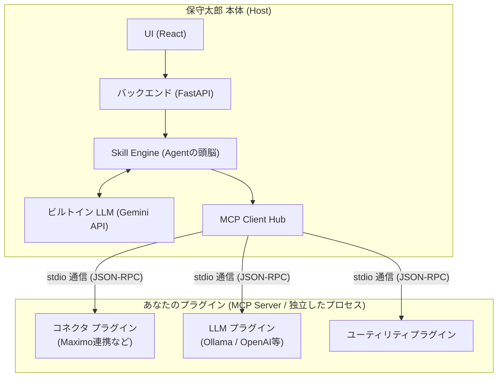

# アーキテクチャ概要 (プラグイン開発者向け)

保守太郎は、内部にデータベースや画面UIを抱える「コアアプリ（保守太郎 Core）」と、サードパーティが開発して機能拡張する「プラグイン（MCP Servers）」が分離されたアーキテクチャを採用しています。

プラグイン開発者が最も理解しておくべきことは、**「自分の作ったプログラムが、どのように保守太郎から呼び出され、データを受け渡すか」**という仕組みの全体像です。

---

## プラグインとは？

保守太郎におけるすべてのプラグインは、**MCP (Model Context Protocol) Server** の標準仕様に則って実装されます。
プラグインの実体は「標準入力 (stdin)」と「標準出力 (stdout)」を使って JSON-RPC メッセージをやり取りする単なる**コンソールプログラム（子プロセス）**です。

### 全体アーキテクチャ図

- 保守太郎本体があなたのプログラムを**コマンドライン引数とともに別プロセスとして起動**します。
- 保守太郎は「君はどんな機能（Tool）を持っているのか？」と聞いてきますので、プラグイン側はJSONで自分が持っている能力の一覧を返します。
- ユーザーから指示があると、保守太郎は必要なタイミングであなたのプログラムの機能を呼び出し、結果を受け取ります。

---

## プラグインのカテゴリ

保守太郎のプラグインは、大きく以下の3カテゴリのいずれかに属します。

1. **コネクタ (connector)**
   - 例: IBM Maximo や SAP PM、あるいは独自の社内データベースとシステム連携を行うもの。
   - 保守太郎側のデータをダウンロードしたり、更新結果をアップロードしたりするための機能 (Tool) を提供します。
2. **LLM アダプタ (llm-adapter)**
   - 例: ローカルの Ollama や OpenAI, OpenVINO を動作させるためのプラグイン。
   - 保守太郎には標準で GeminiAPI が組み込まれていますが、これを別のAIモデルにすり替えるための標準的な Tool (`generate_text` など) を提供します。
3. **ユーティリティ (utility)**
   - 上記以外のすべて。PDFからテキストを抽出する、画像を生成するなど。

---

## Skill Engine による自動呼び出し

プラグイン開発者が関数 (Tool) を公開しても、保守太郎はどのタイミングでそれを使えば良いか最初はわかりません。保守太郎にその使い方を教えるのが **「Skill」** です。

Skill は手順書のような YAML ファイルで、「〇〇コネクタの A という機能を使ってデータを取ってきて、それを使ってから B という機能を呼ぶこと」のように Gemini にAIのふるまいを教える設定ファイルです。

1. あなたはプラグインに特定の機能（Tool）を実装する
2. その機能をAIがうまく使いこなせるための「指示書（Skill YAML）」を作成する
3. ユーザーはUIからその手順書をポチッと実行する

これがプラグイン開発と実行の流れの基本です。

---

## 次のステップ

アーキテクチャの基本を理解したら、[1_GETTING_STARTED.md](./1_GETTING_STARTED.md) に進み、最小限の MCP Server (Hello World プラグイン) を実際に作ってみましょう。