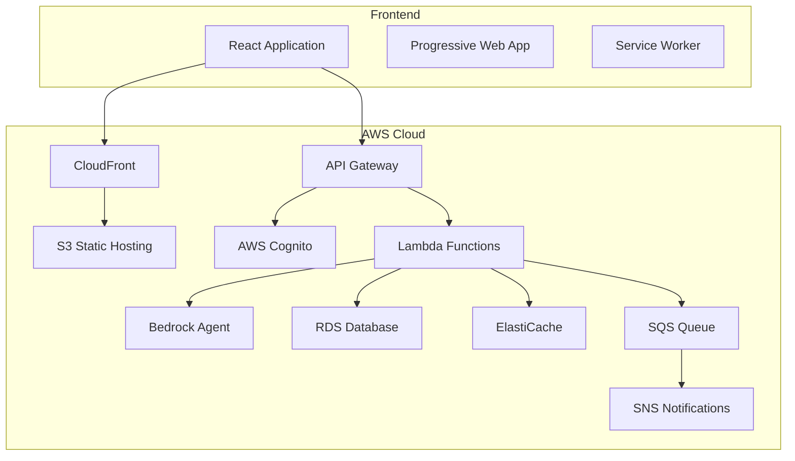

# バックエンド統合技術仕様書

## 概要

本仕様書は、HOSHUTARO フロントエンド改良版と将来のバックエンドシステムとの統合に関する技術仕様を定義します。AWS クラウドサービスを活用したスケーラブルで安全なアーキテクチャを前提としています。

## システムアーキテクチャ

### 全体構成



## API 設計仕様

### 1. 認証・認可 API

#### AWS Cognito 統合

```typescript
// 認証関連の型定義
interface AuthConfig {
  region: string;
  userPoolId: string;
  userPoolWebClientId: string;
  identityPoolId: string;
}

interface User {
  id: string;
  username: string;
  email: string;
  roles: string[];
  permissions: Permission[];
  lastLogin: Date;
  profile: UserProfile;
}

interface UserProfile {
  displayName: string;
  department: string;
  position: string;
  preferences: UserPreferences;
}

interface Permission {
  resource: string;
  actions: string[];
  conditions?: Record<string, any>;
}
```

#### 認証フロー

```typescript
// 認証サービスインターフェース
interface AuthService {
  signIn(username: string, password: string): Promise<AuthResult>;
  signOut(): Promise<void>;
  getCurrentUser(): Promise<User | null>;
  refreshToken(): Promise<string>;
  resetPassword(username: string): Promise<void>;
  changePassword(oldPassword: string, newPassword: string): Promise<void>;
}

interface AuthResult {
  user: User;
  accessToken: string;
  refreshToken: string;
  idToken: string;
  expiresIn: number;
}
```

### 2. データ管理 API

#### 設備データ API

```typescript
// 設備データ関連の型定義
interface EquipmentAPI {
  // 設備データの取得
  getEquipmentList(params: EquipmentListParams): Promise<PaginatedResponse<Equipment>>;
  getEquipmentById(id: string): Promise<Equipment>;
  
  // 設備データの更新
  updateEquipment(id: string, data: Partial<Equipment>): Promise<Equipment>;
  createEquipment(data: CreateEquipmentRequest): Promise<Equipment>;
  deleteEquipment(id: string): Promise<void>;
  
  // 仕様データの管理
  updateSpecifications(equipmentId: string, specs: Specification[]): Promise<Specification[]>;
  
  // 保全データの管理
  getMaintenanceData(equipmentId: string, params: MaintenanceParams): Promise<MaintenanceData[]>;
  updateMaintenanceData(data: MaintenanceUpdateRequest[]): Promise<MaintenanceData[]>;
}

interface EquipmentListParams {
  page?: number;
  limit?: number;
  search?: string;
  hierarchyLevel?: number;
  filters?: FilterCondition[];
  sortBy?: string;
  sortOrder?: 'asc' | 'desc';
}

interface MaintenanceParams {
  startDate: Date;
  endDate: Date;
  timeScale: 'year' | 'month' | 'week' | 'day';
  viewMode: 'status' | 'cost';
}

interface MaintenanceUpdateRequest {
  equipmentId: string;
  timeHeader: string;
  field: string;
  value: any;
  timestamp: Date;
  userId: string;
}
```

#### リアルタイム同期

```typescript
// WebSocket 接続管理
interface RealtimeService {
  connect(): Promise<void>;
  disconnect(): void;
  subscribe(channel: string, callback: (data: any) => void): void;
  unsubscribe(channel: string): void;
  publish(channel: string, data: any): void;
}

// 同期イベント
interface SyncEvent {
  type: 'equipment_updated' | 'maintenance_updated' | 'user_joined' | 'user_left';
  data: any;
  timestamp: Date;
  userId: string;
}

// 競合解決
interface ConflictResolution {
  strategy: 'client_wins' | 'server_wins' | 'merge' | 'manual';
  clientVersion: number;
  serverVersion: number;
  conflictedFields: string[];
  resolution?: Record<string, any>;
}
```

### 3. AI 統合 API

#### AWS Bedrock Agent 統合

```typescript
// AI サービスインターフェース
interface AIService {
  // チャット機能
  sendMessage(message: string, context?: ChatContext): Promise<AIResponse>;
  getConversationHistory(conversationId: string): Promise<ChatMessage[]>;
  
  // Excel 分析
  analyzeExcelFile(file: File, options?: AnalysisOptions): Promise<ExcelAnalysisResult>;
  
  // 保全推奨
  getMaintenanceRecommendations(equipmentId: string, context?: MaintenanceContext): Promise<MaintenanceRecommendation[]>;
  
  // データ品質チェック
  validateData(data: any[], schema: DataSchema): Promise<ValidationResult>;
}

interface ChatContext {
  conversationId: string;
  equipmentIds?: string[];
  currentView?: 'specifications' | 'maintenance' | 'both';
  userRole: string;
}

interface AIResponse {
  message: string;
  suggestions?: ActionSuggestion[];
  confidence: number;
  sources?: string[];
  followUpQuestions?: string[];
}

interface ExcelAnalysisResult {
  mappingSuggestions: ColumnMapping[];
  dataQualityIssues: DataIssue[];
  importPreview: ImportPreview;
  recommendations: string[];
}

interface MaintenanceRecommendation {
  equipmentId: string;
  type: 'preventive' | 'corrective' | 'predictive';
  priority: 'high' | 'medium' | 'low';
  description: string;
  suggestedDate: Date;
  estimatedCost?: number;
  confidence: number;
  reasoning: string[];
}
```

### 4. ファイル管理 API

#### S3 統合

```typescript
// ファイル管理サービス
interface FileService {
  // アップロード
  uploadFile(file: File, options?: UploadOptions): Promise<UploadResult>;
  uploadMultipleFiles(files: File[], options?: UploadOptions): Promise<UploadResult[]>;
  
  // ダウンロード
  downloadFile(fileId: string): Promise<Blob>;
  getFileUrl(fileId: string, expiresIn?: number): Promise<string>;
  
  // 管理
  deleteFile(fileId: string): Promise<void>;
  getFileMetadata(fileId: string): Promise<FileMetadata>;
  listFiles(params: FileListParams): Promise<PaginatedResponse<FileMetadata>>;
}

interface UploadOptions {
  folder?: string;
  tags?: Record<string, string>;
  metadata?: Record<string, string>;
  encryption?: boolean;
  compressionLevel?: number;
}

interface FileMetadata {
  id: string;
  filename: string;
  size: number;
  mimeType: string;
  uploadedAt: Date;
  uploadedBy: string;
  tags: Record<string, string>;
  url?: string;
}
```

## データベース設計

### 1. 設備マスタテーブル

```sql
-- 設備マスタ
CREATE TABLE equipment (
    id UUID PRIMARY KEY DEFAULT gen_random_uuid(),
    bom_code VARCHAR(50) UNIQUE NOT NULL,
    equipment_name VARCHAR(200) NOT NULL,
    hierarchy_level INTEGER NOT NULL CHECK (hierarchy_level IN (1, 2, 3)),
    parent_id UUID REFERENCES equipment(id),
    sort_order INTEGER DEFAULT 0,
    is_active BOOLEAN DEFAULT true,
    created_at TIMESTAMP WITH TIME ZONE DEFAULT CURRENT_TIMESTAMP,
    updated_at TIMESTAMP WITH TIME ZONE DEFAULT CURRENT_TIMESTAMP,
    created_by UUID NOT NULL,
    updated_by UUID NOT NULL
);

-- 設備仕様
CREATE TABLE equipment_specifications (
    id UUID PRIMARY KEY DEFAULT gen_random_uuid(),
    equipment_id UUID NOT NULL REFERENCES equipment(id) ON DELETE CASCADE,
    spec_key VARCHAR(100) NOT NULL,
    spec_value TEXT,
    spec_order INTEGER DEFAULT 0,
    created_at TIMESTAMP WITH TIME ZONE DEFAULT CURRENT_TIMESTAMP,
    updated_at TIMESTAMP WITH TIME ZONE DEFAULT CURRENT_TIMESTAMP,
    UNIQUE(equipment_id, spec_key)
);
```

### 2. 保全データテーブル

```sql
-- 保全計画・実績
CREATE TABLE maintenance_data (
    id UUID PRIMARY KEY DEFAULT gen_random_uuid(),
    equipment_id UUID NOT NULL REFERENCES equipment(id) ON DELETE CASCADE,
    time_header VARCHAR(20) NOT NULL, -- '2024-01', '2024-W01' etc.
    data_type VARCHAR(20) NOT NULL CHECK (data_type IN ('plan', 'actual')),
    status_value VARCHAR(10), -- '○', '△', '×', etc.
    cost_value DECIMAL(15,2),
    cycle_info VARCHAR(50),
    notes TEXT,
    created_at TIMESTAMP WITH TIME ZONE DEFAULT CURRENT_TIMESTAMP,
    updated_at TIMESTAMP WITH TIME ZONE DEFAULT CURRENT_TIMESTAMP,
    created_by UUID NOT NULL,
    updated_by UUID NOT NULL,
    version INTEGER DEFAULT 1,
    UNIQUE(equipment_id, time_header, data_type)
);

-- 変更履歴
CREATE TABLE maintenance_history (
    id UUID PRIMARY KEY DEFAULT gen_random_uuid(),
    maintenance_data_id UUID NOT NULL REFERENCES maintenance_data(id),
    field_name VARCHAR(50) NOT NULL,
    old_value TEXT,
    new_value TEXT,
    changed_at TIMESTAMP WITH TIME ZONE DEFAULT CURRENT_TIMESTAMP,
    changed_by UUID NOT NULL,
    change_reason TEXT
);
```

### 3. ユーザー・権限テーブル

```sql
-- ユーザープロファイル（Cognito補完）
CREATE TABLE user_profiles (
    cognito_user_id VARCHAR(128) PRIMARY KEY,
    display_name VARCHAR(100) NOT NULL,
    department VARCHAR(100),
    position VARCHAR(100),
    preferences JSONB DEFAULT '{}',
    last_login TIMESTAMP WITH TIME ZONE,
    created_at TIMESTAMP WITH TIME ZONE DEFAULT CURRENT_TIMESTAMP,
    updated_at TIMESTAMP WITH TIME ZONE DEFAULT CURRENT_TIMESTAMP
);

-- 権限管理
CREATE TABLE permissions (
    id UUID PRIMARY KEY DEFAULT gen_random_uuid(),
    resource VARCHAR(100) NOT NULL,
    action VARCHAR(50) NOT NULL,
    conditions JSONB DEFAULT '{}',
    UNIQUE(resource, action)
);

CREATE TABLE user_permissions (
    user_id VARCHAR(128) NOT NULL REFERENCES user_profiles(cognito_user_id),
    permission_id UUID NOT NULL REFERENCES permissions(id),
    granted_at TIMESTAMP WITH TIME ZONE DEFAULT CURRENT_TIMESTAMP,
    granted_by VARCHAR(128) NOT NULL,
    PRIMARY KEY(user_id, permission_id)
);
```

## セキュリティ仕様

### 1. 認証・認可

#### JWT トークン検証

```typescript
// Lambda Authorizer
interface JWTPayload {
  sub: string; // User ID
  email: string;
  'cognito:groups': string[];
  'custom:department': string;
  'custom:permissions': string[];
  exp: number;
  iat: number;
}

// 権限チェック
interface AuthorizationContext {
  userId: string;
  roles: string[];
  permissions: string[];
  resource: string;
  action: string;
}

function authorize(context: AuthorizationContext): boolean {
  // 権限チェックロジック
  return checkPermission(context);
}
```

### 2. データ保護

#### 暗号化仕様

```typescript
// データ暗号化設定
interface EncryptionConfig {
  algorithm: 'AES-256-GCM';
  keyRotationPeriod: number; // days
  encryptionAtRest: boolean;
  encryptionInTransit: boolean;
}

// 機密データフィールド
const SENSITIVE_FIELDS = [
  'equipment_specifications.spec_value',
  'maintenance_data.cost_value',
  'user_profiles.preferences'
];
```

### 3. 監査ログ

```sql
-- 監査ログテーブル
CREATE TABLE audit_logs (
    id UUID PRIMARY KEY DEFAULT gen_random_uuid(),
    user_id VARCHAR(128) NOT NULL,
    action VARCHAR(100) NOT NULL,
    resource_type VARCHAR(50) NOT NULL,
    resource_id VARCHAR(128),
    old_values JSONB,
    new_values JSONB,
    ip_address INET,
    user_agent TEXT,
    timestamp TIMESTAMP WITH TIME ZONE DEFAULT CURRENT_TIMESTAMP,
    session_id VARCHAR(128)
);
```

## パフォーマンス仕様

### 1. レスポンス時間要件

| API エンドポイント | 目標レスポンス時間 | 最大レスポンス時間 |
|-------------------|-------------------|-------------------|
| 設備リスト取得 | < 200ms | < 500ms |
| 保全データ取得 | < 300ms | < 800ms |
| データ更新 | < 100ms | < 300ms |
| AI応答 | < 2s | < 5s |
| Excel分析 | < 5s | < 15s |

### 2. キャッシュ戦略

```typescript
// Redis キャッシュ設定
interface CacheConfig {
  equipmentList: {
    ttl: 300; // 5分
    key: 'equipment:list:{hash}';
  };
  maintenanceData: {
    ttl: 60; // 1分
    key: 'maintenance:{equipmentId}:{timeRange}';
  };
  userPermissions: {
    ttl: 3600; // 1時間
    key: 'permissions:{userId}';
  };
}
```

### 3. スケーリング仕様

#### Lambda 関数設定

```yaml
# serverless.yml 例
functions:
  equipmentAPI:
    handler: src/handlers/equipment.handler
    memorySize: 512
    timeout: 30
    reservedConcurrency: 100
    environment:
      DB_CONNECTION_POOL_SIZE: 10
      CACHE_TTL: 300

  aiAssistant:
    handler: src/handlers/ai.handler
    memorySize: 1024
    timeout: 300
    reservedConcurrency: 50
```

## 監視・ログ仕様

### 1. CloudWatch メトリクス

```typescript
// カスタムメトリクス
interface CustomMetrics {
  'Equipment.API.ResponseTime': number;
  'Equipment.API.ErrorRate': number;
  'AI.Assistant.RequestCount': number;
  'Database.ConnectionPool.Usage': number;
  'Cache.HitRate': number;
}
```

### 2. ログ形式

```json
{
  "timestamp": "2024-01-01T00:00:00.000Z",
  "level": "INFO",
  "service": "equipment-api",
  "requestId": "uuid",
  "userId": "cognito-user-id",
  "action": "updateMaintenanceData",
  "resource": "equipment/123",
  "duration": 150,
  "statusCode": 200,
  "message": "Successfully updated maintenance data",
  "metadata": {
    "equipmentId": "123",
    "changedFields": ["status_value"],
    "clientVersion": 1
  }
}
```

## デプロイメント仕様

### 1. CI/CD パイプライン

```yaml
# GitHub Actions ワークフロー
name: Backend Deploy
on:
  push:
    branches: [main]

jobs:
  deploy:
    runs-on: ubuntu-latest
    steps:
      - uses: actions/checkout@v4
      - name: Setup Node.js
        uses: actions/setup-node@v4
        with:
          node-version: '18'
      
      - name: Install dependencies
        run: npm ci
      
      - name: Run tests
        run: npm run test
      
      - name: Deploy to AWS
        run: |
          npm run deploy:staging
          npm run test:integration
          npm run deploy:production
```

### 2. 環境設定

```typescript
// 環境別設定
interface EnvironmentConfig {
  development: {
    apiGateway: {
      stage: 'dev';
      throttling: { burstLimit: 100, rateLimit: 50 };
    };
    database: {
      instanceClass: 'db.t3.micro';
      multiAZ: false;
    };
  };
  
  production: {
    apiGateway: {
      stage: 'prod';
      throttling: { burstLimit: 5000, rateLimit: 2000 };
    };
    database: {
      instanceClass: 'db.r5.large';
      multiAZ: true;
    };
  };
}
```

## 移行計画

### Phase 1: 基盤構築（1-2ヶ月）
1. AWS インフラストラクチャ構築
2. 認証システム（Cognito）統合
3. 基本API（設備データ）実装
4. データベース設計・構築

### Phase 2: コア機能統合（2-3ヶ月）
1. 保全データAPI実装
2. リアルタイム同期機能
3. ファイル管理システム
4. 基本的な監視・ログ

### Phase 3: AI機能統合（1-2ヶ月）
1. Bedrock Agent統合
2. Excel分析機能
3. 保全推奨システム
4. 高度な分析機能

### Phase 4: 最適化・運用（継続）
1. パフォーマンス最適化
2. セキュリティ強化
3. 監視・アラート強化
4. 運用自動化

## 互換性保証

### フロントエンド互換性
- 既存のデータ構造との100%互換性
- 段階的移行によるゼロダウンタイム
- フォールバック機能による安全性確保

### データ移行
- 既存データの完全移行
- データ整合性チェック
- ロールバック機能

この技術仕様書に基づいて、段階的かつ安全にバックエンド統合を進めることができます。