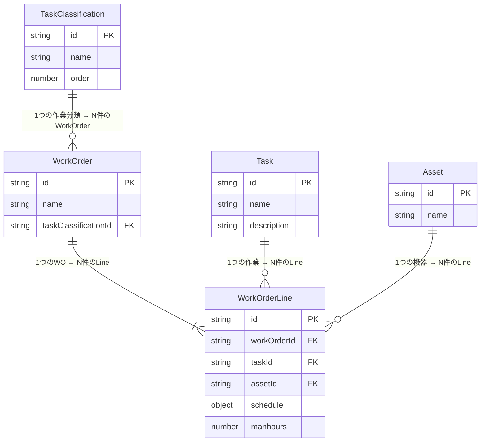
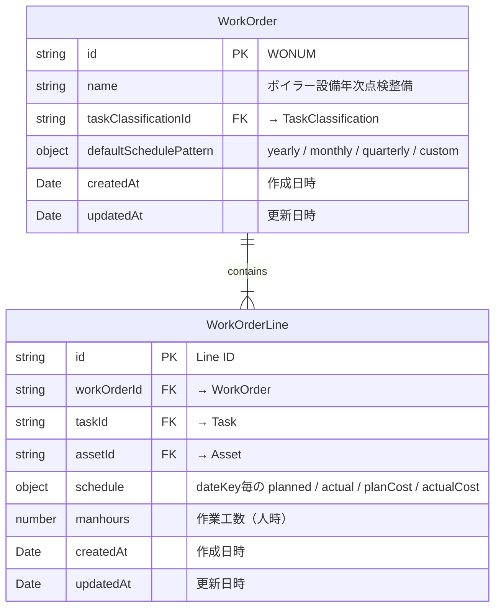
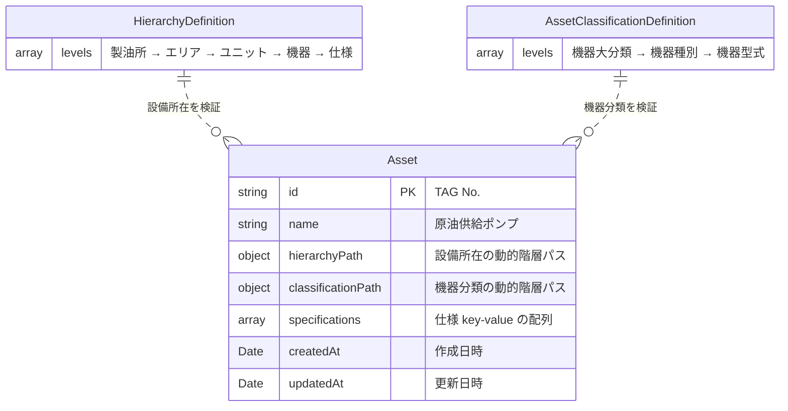

# HOSHUTARO データベース構造定義書（Single Source of Truth）

> **本書はHOSHUTAROの全データ型定義の唯一の正とします。**
> 実装コード: `src/types/maintenanceTask.ts`
>
> **データモデルバージョン**: 3.0.0（WorkOrder + COM 統合モデル）

## 概要

HOSHUTAROは設備保全履歴管理システムとして、IBM Maximo の WorkOrder 概念と COM（Code of Maintenance）分析モデルを統合したデータ構造を採用しています。

### 設計思想

| 概念 | 説明 | 本モデルでの対応 |
|---|---|---|
| **COM (Code of Maintenance)** | 1機器分類×1作業分類 = 保全分析の基本単位 | 分析ビュー（導出） |
| **Maximo WorkOrder** | WONUM(Key)に複数機器・複数作業を紐づける発注単位 | **WorkOrder** エンティティ |
| **星取表セル** | 特定の機器×日付 or 作業×日付の計画/実績 | **WorkOrderLine** エンティティ |

### エンティティ構成

| エンティティ | 役割 |
|---|---|
| **TaskClassification** | 作業分類マスター（20種、フラット） |
| **AssetClassificationDefinition** | 機器分類定義（階層構造） |
| **Task** | 具体的な作業（機器部位＋作業名） |
| **Asset** | 保全対象の設備・機器 |
| **WorkOrder** | 発注/管理単位。複数Task×複数Assetをグルーピング |
| **WorkOrderLine** | 星取表セルレベルデータ。1 Task × 1 Asset × Schedule |

---

## 1. TaskClassification（作業分類マスター）

一階層のフラットなマスター（20種類）。WorkOrder に紐づく作業の種類を示します。

### 構造定義

```typescript
interface TaskClassification {
  id: string;      // "01"-"20"
  name: string;    // "年次点検", "オーバーホール", "SDM", etc.
  order: number;   // 表示順序
}
```

### データ例

```json
[
  { "id": "01", "name": "年次点検", "order": 1 },
  { "id": "02", "name": "隔年点検", "order": 2 },
  { "id": "03", "name": "オーバーホール", "order": 3 },
  { "id": "04", "name": "SDM", "order": 4 },
  { "id": "05", "name": "日常点検", "order": 5 }
]
```

---

## 2. AssetClassificationDefinition（機器分類定義）

HierarchyDefinition と同じ構造を持つ階層定義。機器の型式・種別を分類します。

### 構造定義

```typescript
interface AssetClassificationDefinition {
  levels: AssetClassificationLevel[];  // 1-10レベル対応
}

interface AssetClassificationLevel {
  key: string;       // "機器大分類", "機器種別", "機器型式"
  order: number;     // 表示順序
  values: string[];  // 利用可能な値
}

/** Asset上の分類パス（HierarchyPathと同構造） */
interface AssetClassificationPath {
  [levelKey: string]: string;
}
```

### データ例

```json
{
  "levels": [
    { "key": "機器大分類", "order": 1, "values": ["回転機器", "静止機器", "計装機器"] },
    { "key": "機器種別", "order": 2, "values": ["ポンプ", "コンプレッサー", "塔", "熱交換器", "圧力計"] },
    { "key": "機器型式", "order": 3, "values": ["渦巻き型多段ポンプ", "往復動式コンプレッサー", "充填塔"] }
  ]
}
```

Asset上のパス例:

```json
{
  "機器大分類": "回転機器",
  "機器種別": "ポンプ",
  "機器型式": "渦巻き型多段ポンプ"
}
```

---

## 3. Task（作業）エンティティ

具体的な作業内容を定義します。名前は「機器部位＋作業名」のイメージです。

### 構造定義

```typescript
interface Task {
  id: string;
  name: string;           // "ボイラードラム分解清掃"（機器部位＋作業名）
  description: string;    // 作業説明（必須）
  createdAt: Date;
  updatedAt: Date;
}
```

### データ例

```json
{
  "task-001": {
    "id": "task-001",
    "name": "ボイラードラム分解清掃",
    "description": "ボイラードラム内部の分解および清掃作業",
    "createdAt": "2024-01-01T00:00:00Z",
    "updatedAt": "2024-01-01T00:00:00Z"
  },
  "task-002": {
    "id": "task-002",
    "name": "電動機ベアリング交換",
    "description": "電動機のベアリング取替作業",
    "createdAt": "2024-01-01T00:00:00Z",
    "updatedAt": "2024-01-01T00:00:00Z"
  }
}
```

---

## 4. Asset（機器）エンティティ

保全対象の設備・機器を定義します。設備所在（HierarchyPath）と機器分類（AssetClassificationPath）の2つの階層パスを持ちます。

### 構造定義

```typescript
interface Asset {
  id: string;                                    // TAG No.
  name: string;                                  // 機器名
  hierarchyPath: HierarchyPath;                  // 設備所在（製油所→エリア→ユニット...）
  classificationPath: AssetClassificationPath;   // 機器分類（回転機器→ポンプ→渦巻き型多段...）
  specifications: Specification[];
  createdAt: Date;
  updatedAt: Date;
}

interface HierarchyPath {
  [levelKey: string]: string;   // 動的階層レベル（1-10レベル対応）
}

interface Specification {
  key: string;       // 仕様項目名
  value: string;     // 仕様値
  order: number;     // 表示順序
}
```

### データ例

```json
{
  "P-101": {
    "id": "P-101",
    "name": "原油供給ポンプ",
    "hierarchyPath": {
      "製油所": "第一製油所",
      "エリア": "Aエリア",
      "ユニット": "原油蒸留ユニット"
    },
    "classificationPath": {
      "機器大分類": "回転機器",
      "機器種別": "ポンプ",
      "機器型式": "渦巻き型多段ポンプ"
    },
    "specifications": [
      { "key": "メーカー", "value": "A社", "order": 1 },
      { "key": "型式", "value": "ABC-123", "order": 2 },
      { "key": "容量", "value": "100m³/h", "order": 3 }
    ],
    "createdAt": "2024-01-01T00:00:00Z",
    "updatedAt": "2024-01-01T00:00:00Z"
  }
}
```

---

## 5. WorkOrder（作業指示）エンティティ

発注/管理単位。Maximo の WorkOrder に相当し、複数の Task × Asset を1つのパッケージとしてグルーピングします。名前は業者への発注名のようなイメージです。

### 構造定義

```typescript
interface WorkOrder {
  id: string;                    // WONUM
  name: string;                  // "ボイラー設備年次点検整備"（発注名/集合体名）
  taskClassificationId: string;  // → TaskClassification.id
  defaultSchedulePattern?: {
    frequency: 'yearly' | 'monthly' | 'quarterly' | 'custom';
  };
  createdAt: Date;
  updatedAt: Date;
}
```

### 名前の使い分け

| エンティティ | 名前の例 | 意味 |
|---|---|---|
| **TaskClassification** | 年次点検 / オーバーホール | 作業の種類（20種マスター） |
| **WorkOrder.name** | ボイラー設備年次点検整備 | 発注名。複数Task＋機器の集合体名 |
| **Task.name** | ボイラードラム分解清掃 | 具体的な作業。機器部位＋作業名 |

### データ例

```json
{
  "wo-001": {
    "id": "wo-001",
    "name": "ボイラー設備年次点検整備",
    "taskClassificationId": "01",
    "defaultSchedulePattern": { "frequency": "yearly" },
    "createdAt": "2024-01-01T00:00:00Z",
    "updatedAt": "2024-01-01T00:00:00Z"
  }
}
```

---

## 6. WorkOrderLine（作業明細）エンティティ

星取表のセルレベルデータ。1つの Task × 1つの Asset の日付ごとの計画/実績/費用を管理します。

### 構造定義

```typescript
interface WorkOrderLine {
  id: string;
  workOrderId: string;           // → WorkOrder.id
  taskId: string;                // → Task.id
  assetId: string;               // → Asset.id
  schedule: WorkOrderSchedule;   // 日付ごとの計画/実績/費用
  manhours?: number;             // 作業工数（人時）
  createdAt: Date;
  updatedAt: Date;
}

interface WorkOrderSchedule {
  [dateKey: string]: {           // YYYY-MM-DD, YYYY-MM, YYYY
    planned: boolean;            // 計画フラグ
    actual: boolean;             // 実績フラグ
    planCost: number;            // 計画費用（必須、デフォルト0）
    actualCost: number;          // 実績費用（必須、デフォルト0）
  };
}
```

### データ例

```json
{
  "wol-001": {
    "id": "wol-001",
    "workOrderId": "wo-001",
    "taskId": "task-001",
    "assetId": "P-101",
    "schedule": {
      "2024-01": {
        "planned": true,
        "actual": true,
        "planCost": 50000,
        "actualCost": 48000
      },
      "2024-07": {
        "planned": true,
        "actual": false,
        "planCost": 50000,
        "actualCost": 0
      }
    },
    "manhours": 24,
    "createdAt": "2024-01-01T00:00:00Z",
    "updatedAt": "2024-01-15T00:00:00Z"
  }
}
```

---

## 7. HierarchyDefinition（設備所在階層定義）

設備の所在を示す動的階層構造の定義。

### 構造定義

```typescript
interface HierarchyDefinition {
  levels: HierarchyLevel[];      // 1-10レベル対応
}

interface HierarchyLevel {
  key: string;       // "製油所", "エリア", "ユニット"
  order: number;
  values: string[];
}
```

### HierarchyDefinition と AssetClassificationDefinition の違い

| | HierarchyDefinition | AssetClassificationDefinition |
|---|---|---|
| **目的** | 設備の**所在**（どこにあるか） | 機器の**分類**（何であるか） |
| **例** | 製油所 → エリア → ユニット | 回転機器 → ポンプ → 渦巻き型多段 |
| **Asset上のパス** | `hierarchyPath` | `classificationPath` |

---

## 8. エンティティ関係図

### コアフロー



### WorkOrder 詳細



### Asset 詳細



### リレーションルール

1. **WorkOrder → TaskClassification**: 1つのWOは1つの作業分類に属する
2. **WorkOrder → WorkOrderLine**: 1つのWOは複数のLineを持つ（N件の Task × Asset）
3. **WorkOrderLine → Task**: 各Lineは1つの具体的作業を指す
4. **WorkOrderLine → Asset**: 各Lineは1つの機器を指す
5. **Asset → HierarchyDefinition**: hierarchyPathの検証
6. **Asset → AssetClassificationDefinition**: classificationPathの検証

---

## 9. 全体データモデル

```typescript
interface DataModel {
  version: string;               // "3.0.0"
  tasks: { [id: string]: Task };
  assets: { [id: string]: Asset };
  workOrders: { [id: string]: WorkOrder };
  workOrderLines: { [id: string]: WorkOrderLine };
  hierarchy: HierarchyDefinition;
  taskClassifications: TaskClassification[];
  assetClassification: AssetClassificationDefinition;
  metadata: {
    lastModified: Date;
  };
}
```

### JSON保存形式

```json
{
  "version": "3.0.0",
  "lastModified": "2024-12-10T10:30:00Z",
  "data": {
    "tasks": { ... },
    "assets": { ... },
    "workOrders": { ... },
    "workOrderLines": { ... },
    "hierarchy": { "levels": [ ... ] },
    "taskClassifications": [ ... ],
    "assetClassification": { "levels": [ ... ] }
  }
}
```

---

## 10. 星取表表示マッピング

### 機器ベースモード（タブ名：機器）

```
製油所 > エリア > ユニット
  └─ P-101 原油供給ポンプ   │ 1月 │ 2月 │ 3月 │
                             │  ○  │  ●  │ ◎(2)│ ← 全WorkOrderLineを集約
```

- **行**: Asset（HierarchyPath階層でグルーピング）
- **セル**: 当該Asset×日付の全WorkOrderLineのステータスを集約
- **ダブルクリック**: 当該Asset×日付に関連するWorkOrderのWorkOrderLineを一覧表示

### 作業ベースモード（タブ名：作業）

```
製油所 > エリア > ユニット > P-101 原油供給ポンプ
  ├─ 原油供給ポンプ分解清掃                │  ○  │  ●  │     │
  └─ 原油供給ポンプ電動機ベアリング交換    │     │     │  ○  │
```

- **行**: 階層 → Asset → WorkOrderLine（3階層）
- **セル**: 特定WorkOrderLine（1 Task × 1 Asset）のステータス
- **ダブルクリック**: 当該Asset×日付に関連するWorkOrderのWorkOrderLineを一覧表示

### ダブルクリック動作

どちらのモードでも、セルダブルクリックで **WorkOrderLine一覧ダイアログ** が開きます：

```
┌───────────────────────────────────────────────────────────────┐
│ P-101 原油供給ポンプ — 2024年1月 WorkOrderLine一覧            │
├───────────────────────────────────────────────────────────────┤
│ WO                        │ 作業                │ 計画 │ 実績 │
│ ボイラー設備年次点検整備   │ ドラム分解清掃      │  ○   │  ●  │
│ ボイラー設備年次点検整備   │ 弁体摺り合わせ      │  ○   │     │
│ タービン建設OH             │ ベアリング交換      │  ○   │  ●  │
│                                                               │
│ [WorkOrderLine追加]  [Cancel] [保存]                           │
└───────────────────────────────────────────────────────────────┘
```

---

## 11. ビューモード対応型

### 表示モード

```typescript
type ViewMode = 'equipment-based' | 'task-based';
```

### 機器ベースビュー行

```typescript
interface EquipmentBasedRow {
  type: 'hierarchy' | 'asset';
  level?: number;
  hierarchyKey?: string;
  hierarchyValue?: string;
  assetId?: string;
  assetName?: string;
  hierarchyPath?: HierarchyPath;
  classificationPath?: AssetClassificationPath;
  specifications?: Specification[];
  workOrderLines?: {             // 関連するWorkOrderLine（埋め込み）
    workOrderLineId: string;
    workOrderId: string;
    workOrderName: string;
    taskId: string;
    taskName: string;
    taskClassificationId: string;
    schedule: WorkOrderSchedule;
    manhours?: number;
  }[];
}
```

### 作業ベースビュー行

```typescript
interface TaskBasedRow {
  id: string;
  type: 'hierarchy' | 'asset' | 'workOrderLine';
  level: number;
  // 階層フィールド
  hierarchyKey?: string;
  hierarchyValue?: string;
  // 機器フィールド
  assetId?: string;
  assetName?: string;
  hierarchyPath?: HierarchyPath;
  // WorkOrderLineフィールド
  workOrderLineId?: string;
  workOrderId?: string;
  workOrderName?: string;
  taskId?: string;
  taskName?: string;
  taskClassificationId?: string;
  schedule?: WorkOrderSchedule | { [timeKey: string]: AggregatedStatus };
  manhours?: number;
}
```

### 集約ステータス

```typescript
interface AggregatedStatus {
  planned: boolean;              // 計画フラグ（OR演算）
  actual: boolean;               // 実績フラグ（OR演算）
  totalPlanCost: number;         // 計画コスト合計
  totalActualCost: number;       // 実績コスト合計
  count: number;                 // 実行回数
}
```

---

## 12. 時間スケール・集約

### 時間スケール

```typescript
type TimeScale = 'day' | 'week' | 'month' | 'year';
```

### 階層ロールアップ

- 子階層の実績を親階層に集約
- 計画・実績・費用の合計値を計算
- パフォーマンス最適化のためのキャッシュ機能

---

## 13. COM分析ビュー（導出）

WorkOrderLineデータを `AssetClassification × TaskClassification` で集約すると COM が導出されます。

```typescript
// COM = groupBy(workOrderLines, line => {
//   asset = assets[line.assetId]
//   wo = workOrders[line.workOrderId]
//   return `${asset.classificationPath['機器種別']}_${wo.taskClassificationId}`
// })
```

```
                    │ 01年次点検 │ 03OH   │ 05SDM  │
ポンプ              │ ¥450万    │ ¥1200万│ ¥800万 │ ← 機器分類×作業分類の集約
塔                  │ ¥200万    │ ¥500万 │ ¥2000万│
熱交換器            │ ¥150万    │ ¥300万 │ ¥600万 │
```

> [!NOTE]
> COM分析ビューは将来機能として実装。現フェーズではデータモデル上で導出可能な構造を確保するのみ。

---

## 14. 編集コンテキスト

```typescript
interface EditContext {
  viewMode: ViewMode;
  editScope: 'single-asset' | 'all-assets';
}

interface ScheduleEditRequest {
  workOrderLineId: string;
  dateKey: string;
  scheduleEntry: WorkOrderSchedule[string];
  context: EditContext;
}
```

---

## 15. 操作履歴

```typescript
type HistoryAction =
  | 'CREATE_TASK'
  | 'UPDATE_TASK'
  | 'DELETE_TASK'
  | 'CREATE_WORK_ORDER'
  | 'UPDATE_WORK_ORDER'
  | 'DELETE_WORK_ORDER'
  | 'CREATE_WORK_ORDER_LINE'
  | 'UPDATE_WORK_ORDER_LINE'
  | 'DELETE_WORK_ORDER_LINE'
  | 'UPDATE_HIERARCHY'
  | 'REASSIGN_HIERARCHY'
  | 'UPDATE_ASSET'
  | 'UPDATE_SPECIFICATION';

interface HistoryState {
  timestamp: Date;
  action: HistoryAction;
  data: any;
}
```

---

## 16. エラー型

```typescript
interface ValidationError {
  type: 'VALIDATION_ERROR';
  field: string;
  message: string;
  value: any;
}

interface ReferenceError {
  type: 'REFERENCE_ERROR';
  entityType: 'task' | 'asset' | 'workOrder' | 'workOrderLine';
  entityId: string;
  referencedId: string;
  message: string;
}

interface PerformanceError {
  type: 'PERFORMANCE_ERROR';
  operation: string;
  duration: number;
  threshold: number;
}
```

---

## 17. データ整合性制約

### 参照整合性

1. **WorkOrderLine.workOrderId** → WorkOrder.id（必須）
2. **WorkOrderLine.taskId** → Task.id（必須）
3. **WorkOrderLine.assetId** → Asset.id（必須）
4. **WorkOrder.taskClassificationId** → TaskClassification.id（必須）
5. **Asset.hierarchyPath** → HierarchyDefinition.levels（検証）
6. **Asset.classificationPath** → AssetClassificationDefinition.levels（検証）

### 一意性制約

1. **Task.id**: 全作業で一意
2. **Asset.id**: 全機器で一意
3. **WorkOrder.id**: 全WorkOrderで一意
4. **WorkOrderLine.id**: 全WorkOrderLineで一意

### ビジネスルール

1. **日付キー**: YYYY-MM-DD / YYYY-MM / YYYY 形式
2. **費用**: 0以上の数値（planCost, actualCost ともに必須）
3. **工数**: 0以上の数値（manhours、optional）
4. **WorkOrder削除時**: 関連する全WorkOrderLineも連動削除

---

## 18. インデックス戦略

```typescript
interface DataIndexes {
  // 機器検索用
  assetById: Map<string, Asset>;
  assetsByHierarchy: Map<string, Asset[]>;
  assetsByClassification: Map<string, Asset[]>;

  // 作業検索用
  taskById: Map<string, Task>;

  // WorkOrder検索用
  workOrderById: Map<string, WorkOrder>;
  workOrdersByClassification: Map<string, WorkOrder[]>;

  // WorkOrderLine検索用
  workOrderLineById: Map<string, WorkOrderLine>;
  workOrderLinesByAsset: Map<string, WorkOrderLine[]>;
  workOrderLinesByTask: Map<string, WorkOrderLine[]>;
  workOrderLinesByWorkOrder: Map<string, WorkOrderLine[]>;

  // 階層検索用
  hierarchyByLevel: Map<number, HierarchyLevel>;
}
```

---

## 19. パフォーマンス考慮事項

### データサイズ制限

| 項目 | 上限 |
|---|---|
| 機器数 | 最大50,000件 |
| 作業数 | 最大10,000件 |
| WorkOrder数 | 最大10,000件 |
| WorkOrderLine数 | 最大500,000件 |
| 時間列数 | 最大365日 |
| メモリ使用量 | 500MB未満 |

### 最適化戦略

1. **遅延読み込み**: 必要時にデータを読み込み
2. **仮想スクロール**: 表示行のみレンダリング
3. **メモ化**: 高コスト計算のキャッシュ
4. **インデックス**: O(1)検索のためのMap構造
5. **バッチ処理**: 複数変更の一括実行

---

## 20. Maximo連携（将来計画）

将来的にIBM Maximo REST APIとのデータインターフェースを実装し、Hoshutaro JSON ↔ Maximo オブジェクトの双方向変換を行います。

### エンティティ対応マッピング

| Maximo Object | Hoshutaro Entity | 変換方向 | 備考 |
|---|---|---|---|
| `WORKTYPE` | `TaskClassification` | ↔ | ほぼ1:1対応 |
| `CLASSSTRUCTURE` | `AssetClassificationDefinition` + `Asset.classificationPath` | ↔ | Maximo階層→フラット展開が必要 |
| `LOCATIONS` | `HierarchyDefinition` + `Asset.hierarchyPath` | ↔ | Maximo階層→フラット展開が必要 |
| `ASSET` | `Asset` | ↔ | ASSETNUM = TAG No.基準で対応 |
| `WORKORDER` | `WorkOrder` | ↔ | WONUM → id, WORKTYPE → taskClassificationId |
| `JOBTASK` / `WOACTIVITY` | `WorkOrderLine` | ↔ | タスク分解の粒度調整が必要 |

### モジュール構成

```
src/services/maximo/
├── MaximoMapper.ts          # 双方向変換のコアロジック
├── MaximoExporter.ts        # Hoshutaro JSON → Maximo API用JSON
├── MaximoImporter.ts        # Maximo API JSON → Hoshutaro JSON
└── __tests__/
    └── MaximoMapper.test.ts # 変換ロジックのユニットテスト
```

### 開発フェーズ

| Phase | 内容 | 依存 |
|---|---|---|
| **Phase 1** | JSON ↔ JSON マッピングロジック（`MaximoMapper`） | なし（先行開発可） |
| **Phase 2** | Export機能（Hoshutaro → Maximo JSON生成） | Phase 1 |
| **Phase 3** | Import機能（Maximo JSON → Hoshutaro取り込み） | Phase 1 |
| **Phase 4** | Maximo REST APIクライアント（認証・ページング・エラー処理） | APIアクセス要件確定後 |

> [!NOTE]
> Phase 1〜3はMaximo環境がなくても開発・テスト可能。Phase 4はAPI接続情報が確定してから着手。
